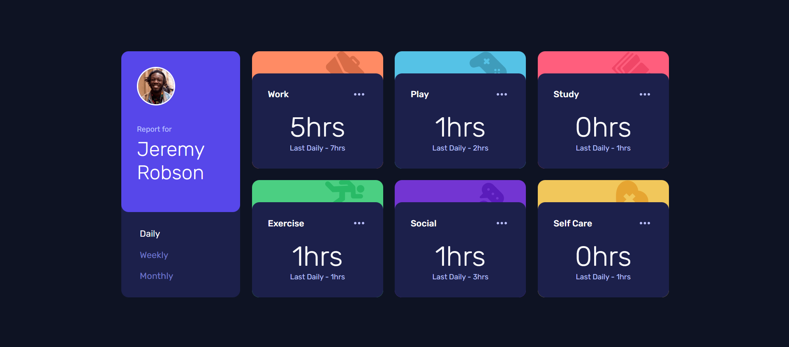

# Frontend Mentor - Time tracking dashboard solution

This is a solution to the [Time tracking dashboard challenge on Frontend Mentor](https://www.frontendmentor.io/challenges/time-tracking-dashboard-UIQ7167Jw). Frontend Mentor challenges help you improve your coding skills by building realistic projects. 

## Table of contents

- [Overview](#overview)
  - [The challenge](#the-challenge)
  - [Screenshot](#screenshot)
  - [Links](#links)
- [My process](#my-process)
  - [Built with](#built-with)
  - [What I learned](#what-i-learned)
  - [Continued development](#continued-development)
  - [Useful resources](#useful-resources)
- [Author](#author)
- [Acknowledgments](#acknowledgments)

## Overview

### The challenge

Users should be able to:

- View the optimal layout for the site depending on their device's screen size
- See hover states for all interactive elements on the page
- Switch between viewing Daily, Weekly, and Monthly stats dynamically using external data

### Screenshot

### Links

- Solution URL: [Github](https://github.com/enghalih/time-tracking-dashboard)
- Live Site URL: [Website](https://enghalih.github.io/time-tracking-dashboard)

## My process

### Built with

- Semantic HTML5 markup
- SCSS (Modern Sass architecture with `@use` and Mixins)
- CSS Grid and Flexbox
- Mobile-first workflow
- Vanilla JavaScript (ES6+)
- **Fetch API** for asynchronous data handling

### What I learned

During this project, I focused on modernizing my workflow and solving complex logic issues regarding data structures. Key takeaways include:

- **Sass Module System:** I transitioned from using `@import` to the modern `@use` rule. I learned how to manage styles using **Namespacing** and **Interpolation** to keep the code scalable and avoid global scope conflicts.
- **Asynchronous Data Handling:** I practiced using the **Fetch API** with `.then()` syntax to load local JSON data. This was a great exercise in understanding how to handle Promises and JSON parsing.
- **Dynamic Object Access:** I solved logic errors related to nested data structures. I learned the critical difference between accessing Array indices and Object keys, specifically when using a variable to call a key dynamically (Bracket Notation).
- **ARIA Best Practices:** I implemented `aria-current="page"` to improve accessibility, ensuring that users with assistive technologies can identify which timeframe is currently active.

### Continued development

- **Error Handling:** I want to dive deeper into `try...catch` blocks for more robust error handling in asynchronous calls.
- **Performance Optimization:** I'm interested in learning more about how background processes and script execution order affect web performance.
- **Accessibility:** I plan to continue practicing WCAG standards to make my future projects more inclusive.

### Useful resources

- [MDN Web Docs - Fetch API](https://developer.mozilla.org/en-US/docs/Web/API/Fetch_API) - This helped me understand how to properly fetch and consume JSON data.
- [Sass Documentation](https://sass-lang.com/documentation/) - A great resource for learning the syntax of `@use` and variable interpolation.

## Author

- Frontend Mentor - [@enghalih](https://www.frontendmentor.io/profile/enghalih)
- Github - [@enghalih](https://github.com/enghalih)
- Linkedin - [@enghalih | Wenning Ghalih](https://www.linkedin.com/in/enghalih/)

## Acknowledgments

Special thanks to my AI thought partner for assisting with the debugging of my JSON data structure and clarifying the transition to modern SCSS modules.